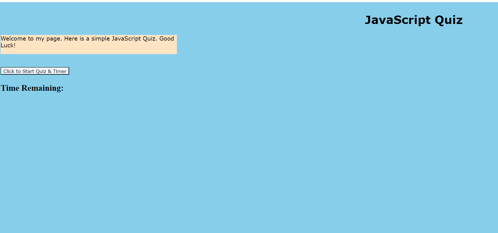
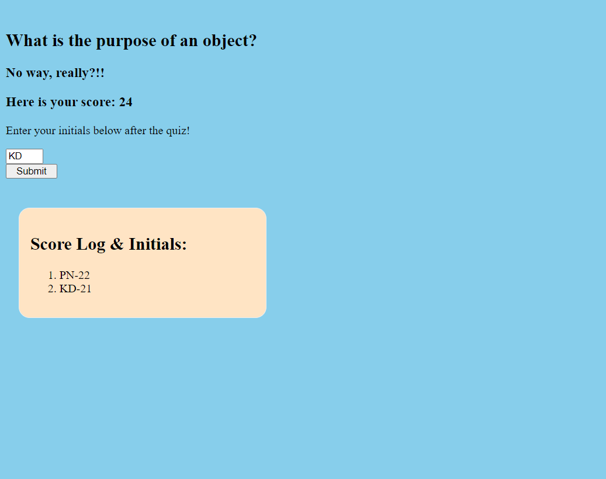

# javaScript_Quiz

## Description
This is the 4th assignment homework, or submission.  The student was given the task to incorporate all three main fields of practice: HTML, CSS, and JavaScript [JS] in order to create a multiple choice quiz, with the main focus on JavaScript.  

## Code Contributors 

The project was completed by each student. This was completed by Paul Nixon.

## User Story
No pre-written code was given.  The student had the task to "start coding from scratch" in order to create the multiple choice quiz focusing primarily on JavaScript.  

## Acceptance Criteria
The assignment is complete when all aspects of the UPENN Module #4 Acceptance Criteria points are met.

## Assets

N/A

Below are two images of the final project:

## Deployment
URL to Deployed Project:

https://paulnxn1.github.io/javaScript_Quiz/

